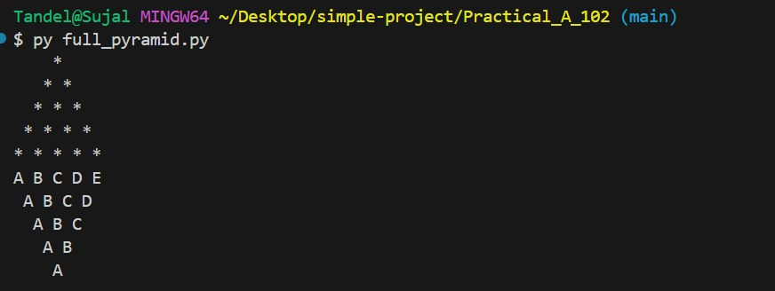
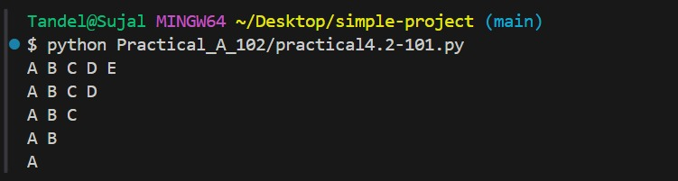
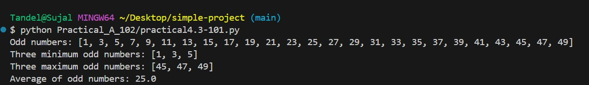

# 🌩 Cloud Computing with DevOps Practical

---

## 📋 Students Information

| Name | Enrollment Number | Practical Set |
|------|-------------------|---------------|
| Sujal Tandel | 202504104610101 | Set A |
| Nandani | 202504104610102 | Set B |

---

## 🖼 Logos

### University: UTU

### Department: SRIMCA

---

## 📘 Subject

Cloud Computing with DevOps

---

## 📂 Practical Overview

This repository contains practical exercises and assignments related to Cloud Computing with DevOps.  
It includes Python programs, GitHub operations, and proper documentation for all tasks.

---

## 📝 Notes

- Each practical task is organized in separate files.
- The requirements.txt file contains all dependencies needed for Python programs.
- Images and documentation are included to make the README informative and visually clear.

---

## 📁 Files

- even_numbers.py  
- full_pyramid.py  
- practical_3_2.py  
- practical_3.py  
- practical_3_3.py  
- right_half_pyramid.py  
- requirements.txt  

---

## 📸 Output Screenshots

---

## ✅ Conclusion

This project demonstrates Python programming and GitHub repository management as part of Cloud Computing with DevOps practical work.

Developed by:
- **Sujal Tandel (101)**
- **Nandani (102)**